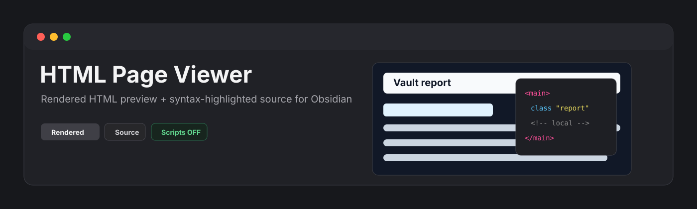
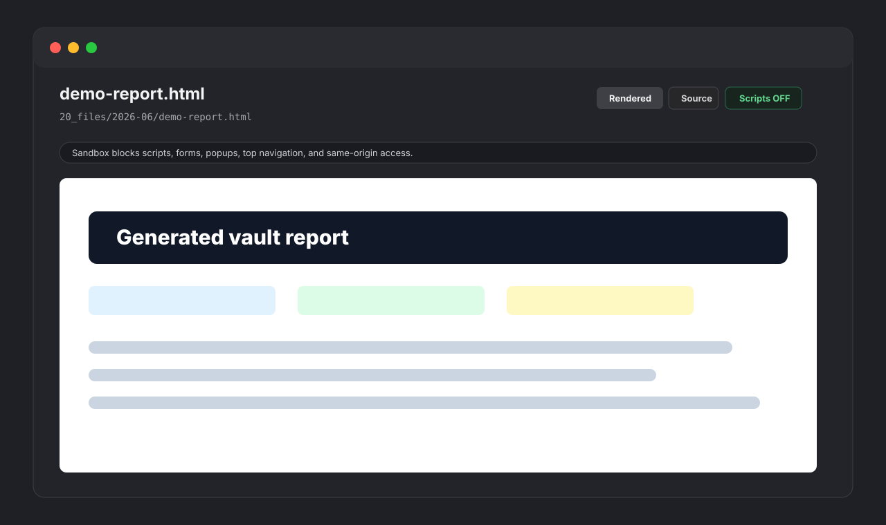

<p align="center">
  
</p>

<p align="center">
  <a href="https://github.com/viggomeesters/obsidian-html-page-viewer/releases/latest"></a>
  <a href="LICENSE"></a>
  
  
</p>

# HTML Page Viewer

HTML Page Viewer is a read-only Obsidian plugin for opening `.html` and `.htm` files as rendered pages inside Obsidian. It is built for local reports, exported dashboards, documentation pages, prototypes, and generated visual artifacts that you want to inspect without leaving the vault.



## Features

- Opens `.html` and `.htm` files in a dedicated Obsidian view.
- Shows a rendered preview by default.
- Provides a source view with lightweight HTML syntax highlighting and line numbers.
- Includes a toolbar for Rendered/Source, Refresh, and Scripts OFF/ON.
- Keeps scripts disabled by default.
- Enables scripts only for the current viewer tab when explicitly toggled on.
- Renders through a sandboxed iframe.
- Blocks forms, popups, top-level navigation, and same-origin access.
- Stays read-only by design: it never writes back to HTML files.

## Security model

HTML files can execute powerful browser behavior if a viewer permits it. HTML Page Viewer uses a conservative default:

- Scripts are **OFF** by default.
- Scripts **ON** adds only `allow-scripts` to the iframe sandbox.
- The iframe is never granted `allow-same-origin`, `allow-forms`, `allow-popups`, or `allow-top-navigation`.
- The plugin code does not make network requests.
- The plugin code does not read or write the system clipboard.
- The plugin code does not edit vault files.

Rendered HTML may still request external resources, such as images, stylesheets, fonts, or scripts, when the HTML document itself references them. This is normal browser behavior for rendered HTML pages and is separate from plugin code making network requests.

## Why read-only?

HTML reports and exported pages are often generated artifacts. HTML Page Viewer intentionally does not write to disk, so it cannot reformat, truncate, or corrupt your files.

## Installation

### Community plugin directory

HTML Page Viewer is ready for submission to the Obsidian Community plugin directory. Once accepted, it can be installed from **Settings -> Community plugins -> Browse** inside Obsidian.

### Manual installation

Until the community directory submission is accepted:

1. Download `main.js`, `manifest.json`, and `styles.css` from the [latest release](https://github.com/viggomeesters/obsidian-html-page-viewer/releases/latest).
2. Create this folder in your vault: `.obsidian/plugins/html-page-viewer/`.
3. Put the downloaded files in that folder.
4. Reload Obsidian.
5. Enable **HTML Page Viewer** in **Settings -> Community plugins**.

### BRAT installation

For beta testing, install the plugin with [BRAT](https://github.com/TfTHacker/obsidian42-brat) using this repository URL:

```text
https://github.com/viggomeesters/obsidian-html-page-viewer
```

## Usage

Open any `.html` or `.htm` file in your vault. Obsidian will open it with HTML Page Viewer.

Use the toolbar to:

- switch between the rendered preview and source view
- refresh the rendered preview after file changes
- turn scripts on or off for the current viewer tab

Scripts are intentionally per-tab. Opening a new HTML file starts with scripts off again.

## Development

```bash
npm install
npm run build
npx tsc --noEmit
npm test
```

For local development, copy or symlink this repository into `.obsidian/plugins/html-page-viewer/` inside an Obsidian vault.

## Release process

Obsidian installs community plugin files from GitHub releases. For each release:

1. Update `manifest.json`, `package.json`, and `versions.json`.
2. Run `npm install`, `npm run build`, `npx tsc --noEmit`, and `npm test`.
3. Create a GitHub release whose tag exactly matches `manifest.json.version`.
4. Attach `main.js`, `manifest.json`, and `styles.css` as release assets.

## Community directory submission

The repository is prepared for Obsidian Community plugin submission. The remaining submission step must be completed by the repository owner in the Obsidian Community site because it requires signing in, linking GitHub, and confirming the developer policies/support commitment.

Submit this repository URL:

```text
https://github.com/viggomeesters/obsidian-html-page-viewer
```

Steps:

1. Sign in to [community.obsidian.md](https://community.obsidian.md).
2. Link the GitHub account that owns this repository.
3. Open **Plugins -> New plugin**.
4. Enter the repository URL above.
5. Confirm the developer policies and submit.
6. Address any automated review feedback.

The current release is ready for review:

- root `README.md`, `LICENSE`, and `manifest.json` exist
- `manifest.json.version` is `0.1.0`
- GitHub release `0.1.0` exists
- release assets include `main.js`, `manifest.json`, and `styles.css`
- `versions.json` maps supported Obsidian versions

Official references:

- [Submit your plugin](https://docs.obsidian.md/Plugins/Releasing/Submit%20your%20plugin)
- [Obsidian releases repository](https://github.com/obsidianmd/obsidian-releases)

## License

[MIT](LICENSE)
